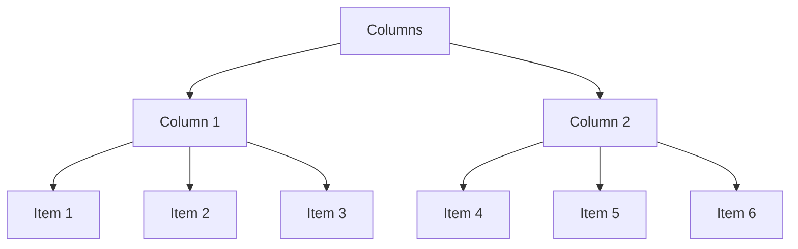

# Use Sortable

A react hook used in sorting and managing data in Drag n Drop layouts, it allows sorting and reordering of items within its column and also across multiple columns, it also allows the reordering of columns in the context. this hook also reorder based on the data type **order**, this allows the persistence of the DnD layout with the backend of your application. This hook can also be used with any react Drag n Drop library as long as the input type is consistent.

# Installation

Using npm:

```
$ npm install @wazza99/use-sortable
```

## Data Structure

Using a data structure where we can have multiple columns and each columns could contain multiple items.



## Usage

### Basic

```typescript
//initial data
const initialColumns= [
	{
	id:  'column1',
	order:  1,
	name:  'Todo',
	//other data points...
	tasks: [
		{
			id:'1',
			title:'Task 1 title',
			order:1,
			//other data points...
		},
		{
			id:'2',
			title:'Task 2 title',
			order:2,
		}
	],
		},
	{
	id:  'column2',
	order:  2,
	name:  'In-Progress',
	tasks:[
		{
			id:"3",
			order:1
			title:"Task 3 title"
		}
	]
	}
	]

const { columns, dragEndHandler, fns} = useSortable(initialColumns, 'tasks');

const options = { reorderColumn:true, columnsDroppableId:'all-columns' }

const  handleDrag = (result) => {
	dragEndHandler( result, options );
};
```

### With optimistic updates

```typescript
async function updateItem(values: OptimisticItemData) {
  //values contains the previous and current optimistc info of the dropped item, you can use this to update your backend
  const data = await createPromise(values, 3000);
}

async function updateColumn(values: OptimisticColumnData) {
  const data = await createPromise(values, 3000);
}

const options = { reorderColumn: true, columnsDroppableId: 'all-columns' };
const updates = { updateItem, updateColumn };

const handleDrag = (result) => {
  dragEndHandler(result, options, updates);
};
```

### Helper functions

```typescript
const { columns, dragEndHandler, fns } = useSortable(initialColumns, 'tasks');

// Example usage of the functions
fns.createColumnItem('column1', { id: 'task7', title: 'Item 7' });
fns.removeColumnItem('task1');
fns.updateColumnItem('task1', { title: 'New title' });
fns.createColumn({ id: 'column2', name: 'Doing', tasks: [] });
fns.updateColumn('column2', { name: 'New name' });
fns.removeColumn('column2');
```

## API

#### Parameters

| Parameter        | Type     | Description                           |
| ---------------- | -------- | ------------------------------------- |
| `initialColumns` | `array`  | Initial set of columns.               |
| `key`            | `string` | Key to identify the items in columns. |

### Returns

| Property         | Type       | Description                                               |
| ---------------- | ---------- | --------------------------------------------------------- |
| `columns`        | `array`    | The current state of the columns with optimistic updates. |
| `dragEndHandler` | `function` | Function to handle drag end events.                       |
| `fns`            | `object`   | Object containing functions to manipulate columns .       |

### `fns` Object

| Function           | Description                                 | Type       |
| ------------------ | ------------------------------------------- | ---------- |
| `createColumnItem` | Creates a new item in the specified columnn | `function` |
| `removeColumnItem` | Removes an item from the columns.           | `function` |
| `updateColumnItem` | Updates an item in the columns.             | `function` |
| `createColumn`     | Creates a new column.                       | `function` |
| `updateColumn`     | Updates a column.                           | `function` |
| `removeColumn`     | Removes a column.                           | `function` |

## Important information

- All `columns` and `items` must have a unique Id and and initial order.
- If using a DnD react library, it is important that the draggable id of every item is the same as its `item id`, this also applies in the case of `columns`.
